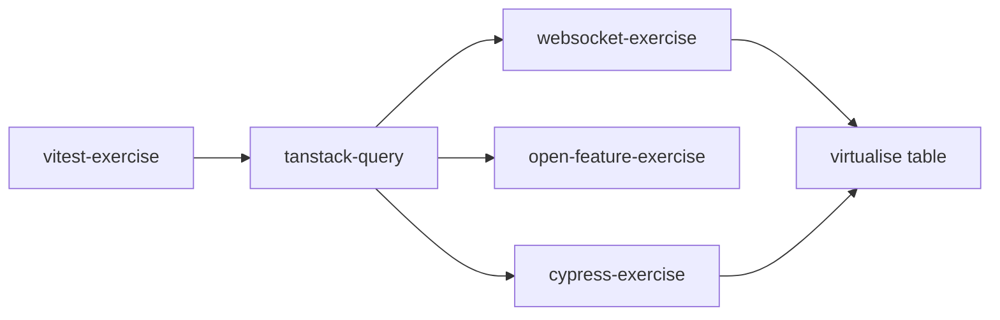
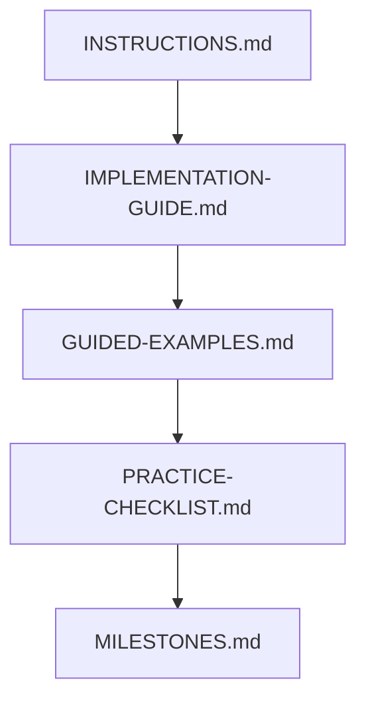

# Exercise Order

## Goal
This file tells you:
- which exercise to do first
- how hard each one is
- which docs to open depending on how stuck you are

You do **not** need to use the maximum help level immediately.
Start light. Escalate only when needed.

---

## Recommended order

1. `vitest-exercise`
2. `tanstack-query`
3. `cypress-exercise`
4. `open-feature-exercise`
5. `sse-exercise`
6. `websocket-exercise`
7. `virtualise table`

---

## Why this order

### 1) `vitest-exercise`
**Difficulty:** Easy → Medium  
**Why first:** fastest feedback loop, smallest units, best place to learn structure and edge-case thinking.

You learn:
- function design
- test structure
- edge cases
- when to mock and when not to

### 2) `tanstack-query`
**Difficulty:** Medium  
**Why second:** introduces async server state without full real-time or E2E complexity.

You learn:
- server state vs client state
- query keys
- loading/error/success states
- invalidation after mutation

### 3) `cypress-exercise`
**Difficulty:** Medium  
**Why third:** now you already understand app flow and async UI, so E2E testing makes more sense.

You learn:
- user-flow testing
- selectors
- visible assertions
- deterministic browser tests

### 4) `open-feature-exercise`
**Difficulty:** Medium  
**Why fourth:** conceptually simple, but it teaches clean architecture and runtime behavior switching.

You learn:
- providers
- flag evaluation
- default values
- context-aware behavior

### 5) `websocket-exercise`
**Difficulty:** Medium → Hard  
**Why fifth:** real-time state is harder than request/response state.

You learn:
- connection lifecycle
- protocol design
- incoming event handling
- reconnect thinking

### 6) `virtualise table`
**Difficulty:** Hard  
**Why last:** requires UI rendering plus math plus performance reasoning.

You learn:
- viewport math
- overscan
- scroll behavior
- rendering performance

---

## Difficulty map

| Exercise | Difficulty | Main challenge |
|---|---|---|
| `vitest-exercise` | Easy → Medium | thinking in small behaviors |
| `tanstack-query` | Medium | async server-state flow |
| `cypress-exercise` | Medium | turning UI behavior into E2E tests |
| `open-feature-exercise` | Medium | provider + runtime decision flow |
| `websocket-exercise` | Medium → Hard | real-time event lifecycle |
| `virtualise table` | Hard | scroll math + performance |

---

## Which doc to open depending on how lost you are

Each exercise now has **5 help levels**.

### Level 1 — Light overview
Open:
- `INSTRUCTIONS.md`

Use when:
- you want the concept first
- you want to try mostly from memory
- you only need the dependency and flow overview

### Level 2 — Concrete assignment
Open:
- `IMPLEMENTATION-GUIDE.md`

Use when:
- you know the topic but don’t know what exact files to create
- you need the implementation order
- you want “what should I build first?” guidance

### Level 3 — Code-shaped help
Open:
- `GUIDED-EXAMPLES.md`

Use when:
- you need help with actual file/function/component shape
- you want example code patterns
- you are close, but still stuck translating the idea into code

### Level 4 — Drill mode
Open:
- `PRACTICE-CHECKLIST.md`

Use when:
- you want repetition
- you want to rebuild the same thing multiple times
- you want a clear before/during/after checklist

### Level 5 — Progress ladder
Open:
- `MILESTONES.md`

Use when:
- you want to know what “next” means
- you want to work in small levels
- you want to stop at a reasonable checkpoint

---

## Suggested help escalation
Do not start at max help unless you really need it.

Use this order:
1. `INSTRUCTIONS.md`
2. `IMPLEMENTATION-GUIDE.md`
3. `GUIDED-EXAMPLES.md`
4. `PRACTICE-CHECKLIST.md`
5. `MILESTONES.md`

Mental rule:
- **confused about concept** → `INSTRUCTIONS.md`
- **confused about what to build** → `IMPLEMENTATION-GUIDE.md`
- **confused about code shape** → `GUIDED-EXAMPLES.md`
- **confused about repetition / retention** → `PRACTICE-CHECKLIST.md`
- **confused about next step** → `MILESTONES.md`

---

## If you want the easiest path through the repo

### Phase 1 — Testing foundation
- `vitest-exercise`

### Phase 2 — Async app state
- `tanstack-query`

### Phase 3 — Full browser behavior
- `cypress-exercise`

### Phase 4 — Runtime product behavior
- `open-feature-exercise`

### Phase 5 — Real-time systems
- `websocket-exercise`

### Phase 6 — Performance and rendering math
- `virtualise table`

---

## If you get overwhelmed
Do this:
- pick only one exercise
- do only Level 0 or Level 1 milestone
- stop after one working behavior
- repeat tomorrow

You do **not** need to complete a whole exercise in one sitting.

---

## Suggested session style

### 30 minutes
- 5 min read
- 20 min type
- 5 min recap

### 60 minutes
- 10 min read
- 35 min implement
- 10 min fix and clean up
- 5 min explain what you learned out loud

---

## Choose by learning goal

### If you want to learn testing first
Start with:
- `vitest-exercise`
- then `cypress-exercise`

### If you want to learn async data flow
Start with:
- `tanstack-query`
- then `websocket-exercise`

### If you want to learn architecture and clean boundaries
Start with:
- `open-feature-exercise`
- then `tanstack-query`

### If you want to learn performance
Start with:
- `virtualise table`

---

## Repo progression map

## Help-level map

---

## Best next move
If you want the smoothest path:
1. finish `vitest-exercise`
2. move to `tanstack-query`
3. then `cypress-exercise`

That sequence gives you the best compounding payoff.
