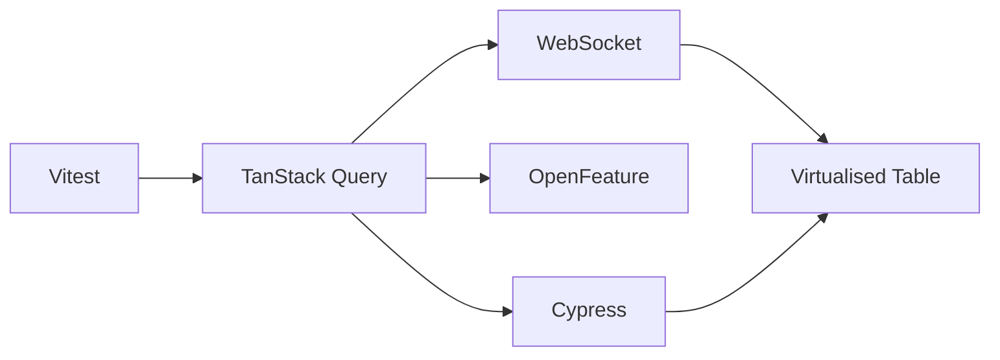
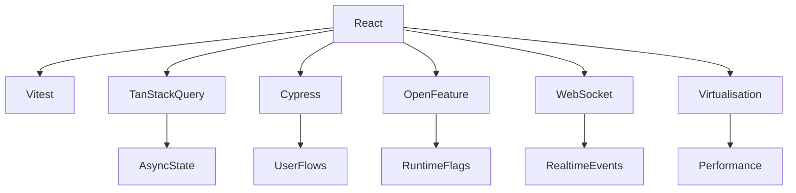

# Learning Plan

## Goal
Use these folders to learn by **typing the code yourself repeatedly**, not by copying finished solutions.

This repo now has two layers of guidance:
- `INSTRUCTIONS.md` in each exercise folder: concepts, dependencies, flow, and mental model
- `MILESTONES.md` in each exercise folder: step-by-step difficulty progression

## How to use this repo
For each folder:
1. read `INSTRUCTIONS.md`
2. skim `MILESTONES.md`
3. build the feature from memory as much as possible
4. get stuck only long enough to re-read the next milestone
5. delete and retype key parts again

The point is not finishing fast.
The point is making the dependency graph, control flow, and mental model feel obvious.

## Recommended order
Start from fastest feedback and simplest concepts, then move toward more async and integration-heavy topics.

1. `vitest-exercise`
2. `tanstack-query`
3. `cypress-exercise`
4. `open-feature-exercise`
5. `websocket-exercise`
6. `virtualise table`

## Why this order
- **Vitest** teaches small behavior loops and confidence
- **TanStack Query** teaches server-state flow
- **Cypress** teaches full user-flow testing
- **OpenFeature** teaches dependency boundaries and runtime behavior switching
- **WebSocket** teaches real-time event flow and lifecycle
- **Virtualised table** teaches performance and rendering math

## Repetition method
For every exercise, do 3 passes:

### Pass 1: Guided
- read the instructions
- follow the milestones
- type everything yourself
- do not paste large chunks

### Pass 2: Reduced guidance
- close most of the guide
- rebuild from memory
- only check the guide when blocked

### Pass 3: Recall under pressure
- start from an empty folder
- rebuild the core idea without looking
- explain out loud what each dependency does

## What to repeat in every exercise
Try to say these out loud while coding:
- What dependency owns what responsibility?
- What is the data flow?
- What triggers a re-render or update?
- What is local state vs external state?
- What can fail, and where?
- What should be tested?

## Session format
Use short sessions.

### 30-minute session
- 5 min: read guide
- 20 min: type
- 5 min: summarize what you learned

### 60-minute session
- 10 min: read guide and choose milestone
- 35 min: type from memory
- 10 min: fix rough edges
- 5 min: write your own recap notes

## Difficulty ladder
Use this pattern in each folder:
1. make it work
2. make it understandable
3. make it testable
4. make it resilient
5. make it faster or more scalable

## What “done” means for learning
You are not done when the app merely runs.
You are done when you can:
- explain the dependencies without guessing
- rebuild the main flow from memory
- describe common failure cases
- make one small variation without getting lost

## Cross-topic mental map

## Skill map by topic

## Personal rule
Do not ask for the final code first.
Ask for:
- a missing concept
- a review of your code
- a hint for the next milestone
- a bug explanation

That will help you learn much faster than reading a full solution.
