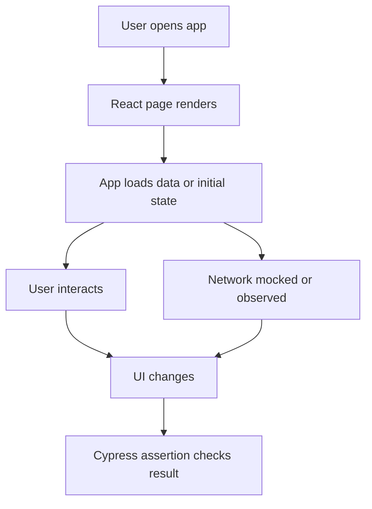
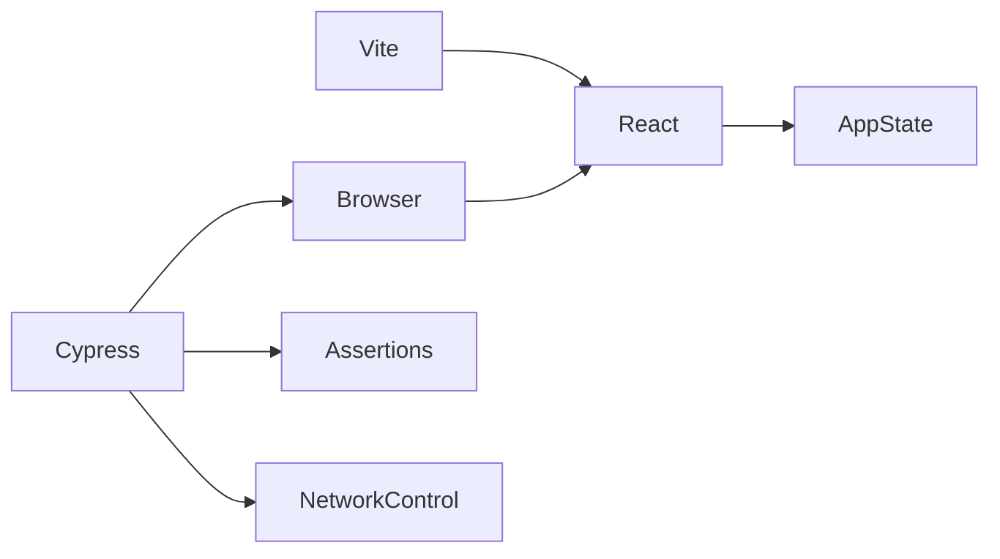

# Cypress Exercise

## What is already done for you
- scaffold app created
- dependencies will be installed
- starter folders exist so you can focus on the exercise

## Read these in order
1. `INSTRUCTIONS.md`
2. `IMPLEMENTATION-GUIDE.md`
3. `GUIDED-EXAMPLES.md`
4. `PRACTICE-CHECKLIST.md`
5. `MILESTONES.md`

## Goal
Build a small app and test it end-to-end with Cypress so you learn how the browser, your app, and the test runner interact.

## What you should build
Create a tiny React app with a realistic user flow:
- render a page
- fetch or load a list
- let the user filter, add, edit, or delete something
- show loading, success, and error states

Do **not** start with Cypress first. Build the UI flow first, then automate it.

## Dependency map
- **React**: renders the UI
- **Vite**: local dev server
- **Cypress**: runs browser-based end-to-end tests
- **Your app state**: drives the screen
- **Optional mock API**: gives predictable test data

## Core concepts to learn
1. **End-to-end testing**: test the app like a real user
2. **Selectors**: target stable elements, ideally with `data-*` attributes
3. **Assertions**: verify what the user sees
4. **Test isolation**: every test should start clean
5. **Network control**: stub or observe requests when needed
6. **Happy path + edge cases**: loading, empty, error, success

## Recommended build order
1. Create the app shell
2. Add one complete user flow
3. Add stable selectors for important UI nodes
4. Open Cypress and write one happy-path test
5. Add tests for empty/error states
6. Add tests for form validation or list mutation
7. Refactor tests to be readable and repeatable

## Repetition drill
Type this flow from memory multiple times:
1. open page
2. find element
3. perform user action
4. wait for UI update or request
5. assert visible result
6. assert final state

Then repeat with:
- success case
- validation failure
- API failure
- empty data

## File structure idea
- `src/` for app code
- `cypress/e2e/` for tests
- `cypress/support/` for setup and shared commands
- `fixtures/` if you want static sample data

## What to focus on while typing
- Name tests by user intent, not implementation
- Prefer visible behavior over internal state checks
- Keep selectors stable
- Keep each test independent

## Mermaid flow

## Dependency graph

## Practice prompts
- Test a todo create flow
- Test a login form with validation
- Test filtering a product list
- Test retry after API failure

## Done when
- you can run the app
- you can run Cypress
- you have at least 3 meaningful user-flow tests
- you understand why each assertion exists