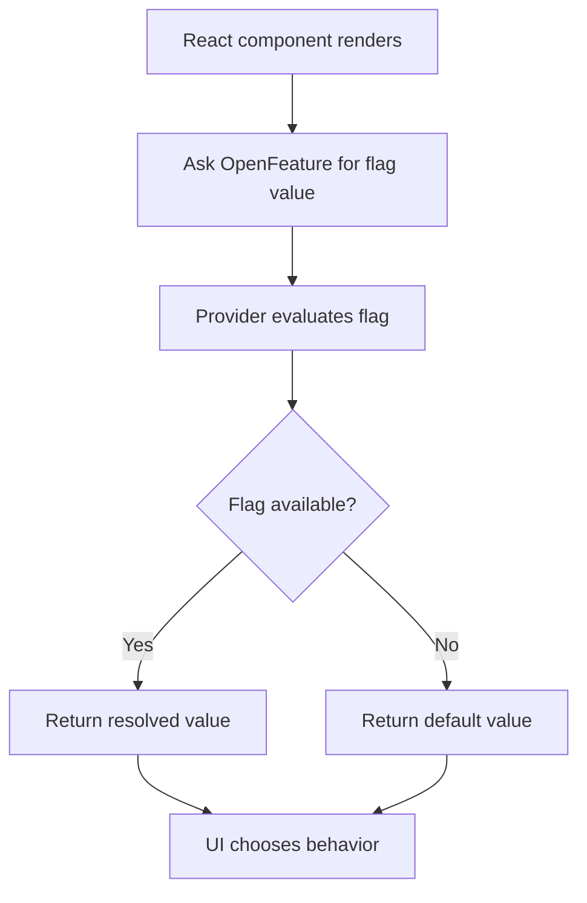
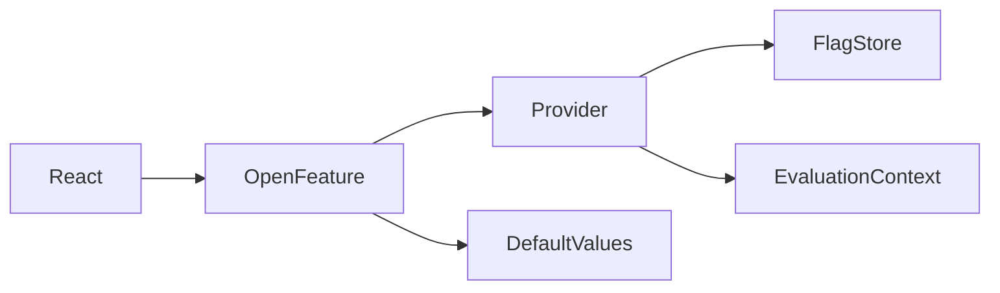

# OpenFeature Exercise

## What is already done for you
- scaffold app created
- dependencies will be installed
- starter folders exist so you can focus on the exercise

## Read these in order
1. `INSTRUCTIONS.md`
2. `IMPLEMENTATION-GUIDE.md`
3. `GUIDED-EXAMPLES.md`
4. `PRACTICE-CHECKLIST.md`
5. `MILESTONES.md`

## Goal
Build a small feature-flagged React app using **OpenFeature** so you understand how flags control behavior without scattering conditionals everywhere.

## What you should build
Create one app with 2-3 feature flags, for example:
- show/hide a banner
- old list view vs new card view
- enable/disable a premium action

Use flags to change **behavior**, not just text.

## Dependency map
- **React**: UI rendering
- **OpenFeature**: standard API for flag evaluation
- **Feature flag provider**: source of truth for flag values
- **Context / targeting**: optional user or environment data for evaluation

## Core concepts to learn
1. **Flag evaluation**: ask for a boolean/string/number value
2. **Provider**: implementation that returns the values
3. **Default values**: fallback when provider fails or flag is missing
4. **Targeting context**: evaluate by user, role, or environment
5. **Progressive delivery mindset**: ship safely, expose gradually
6. **Separation of concerns**: UI reads flags, provider owns flag logic

## Recommended build order
1. Build a basic screen without flags
2. Identify one behavior to guard with a boolean flag
3. Add OpenFeature setup
4. Add a simple local provider with hardcoded values
5. Read flag values in the UI
6. Add a second flag with a different type if possible
7. Add targeting context for user role or environment
8. Test fallback behavior when a flag is unavailable

## Repetition drill
Repeat this pattern until it feels automatic:
1. define the product behavior
2. name the flag clearly
3. decide the default value
4. evaluate the flag close to where behavior changes
5. keep provider logic outside UI components

## Suggested flags
- `showPoints`
- `useNewCheckout`
- `enableBetaSearch`
- `pricingVariant`

## What to think about while typing
- What happens if the provider is down?
- What is the safest default?
- Is this flag temporary or long-lived?
- Is the flag changing presentation only, or business behavior too?

## Mermaid flow

## Dependency graph

## Practice prompts
- Hide a beta feature for anonymous users
- Switch between old and new layouts
- Enable admin-only controls
- Toggle a risky network call path

## Done when
- you can explain provider vs consumer
- you can add a new flag without confusion
- you can choose safe defaults confidently
- you can describe where targeting context belongs