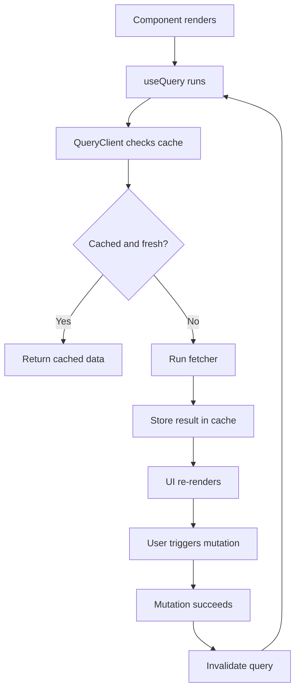
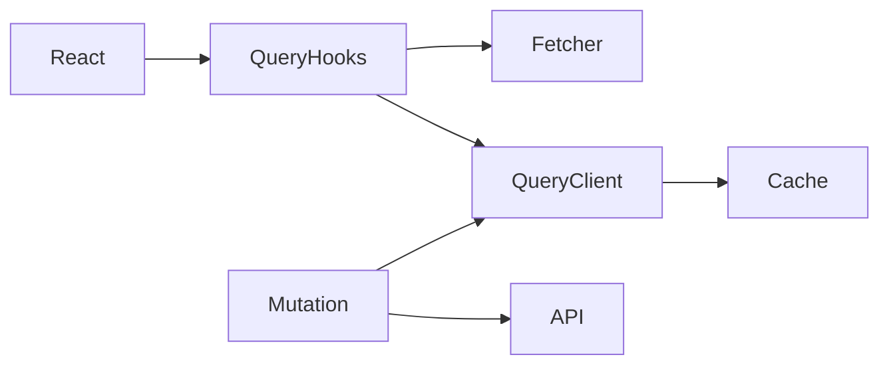

# TanStack Query Exercise

## What is already done for you
- scaffold app created
- dependencies will be installed
- starter folders exist so you can focus on the exercise

## Read these in order
1. `INSTRUCTIONS.md`
2. `IMPLEMENTATION-GUIDE.md`
3. `GUIDED-EXAMPLES.md`
4. `PRACTICE-CHECKLIST.md`
5. `MILESTONES.md`

## Goal
Build a React app that fetches server data with **TanStack Query** so you learn the difference between server state and local UI state.

## What you should build
Create a small screen that:
- loads a list from an API
- shows loading, error, and success states
- lets the user refetch
- optionally create/update/delete an item with a mutation

## Dependency map
- **React**: renders the UI
- **TanStack Query**: caches and manages async server state
- **QueryClient**: central cache and query coordination
- **Query keys**: identify cached resources
- **Fetcher functions**: call the API
- **Mutations**: write data back to the server

## Core concepts to learn
1. **Server state vs client state**
2. **Query keys**: stable identifiers for cache entries
3. **Loading/error/success lifecycle**
4. **Caching**: avoid unnecessary refetches
5. **Invalidation**: refresh stale data after mutation
6. **Background refetching**
7. **Optimistic updates**: optional advanced step

## Recommended build order
1. Create the page and plain fetcher function
2. Add `QueryClient` setup
3. Wrap the app with the provider
4. Use one query to fetch a list
5. Render loading/error/success states clearly
6. Add a manual refetch button
7. Add one mutation
8. Invalidate the related query after mutation
9. Optionally try optimistic UI

## Repetition drill
Practice this loop until it feels natural:
1. define resource name
2. choose query key
3. write fetch function
4. call query hook
5. render lifecycle states
6. mutate data
7. invalidate related query

## What to focus on while typing
- Query keys must be predictable
- Keep fetchers separate from components
- Do not overuse local state for server data
- Invalidate the smallest useful scope
- Think about stale vs fresh, not just loaded vs unloaded

## Common mistakes to avoid
- using unstable query keys
- duplicating query data in component state
- forgetting error UI
- forgetting invalidation after mutation
- mixing form state and server cache responsibilities

## Mermaid flow

## Dependency graph

## Practice prompts
- Load a users list
- Fetch a product detail screen
- Submit a form and refresh the list
- Add filter params to the query key

## Done when
- you can explain server state clearly
- you can add a query from memory
- you know when to invalidate
- you can reason about loading, stale, and refetching states