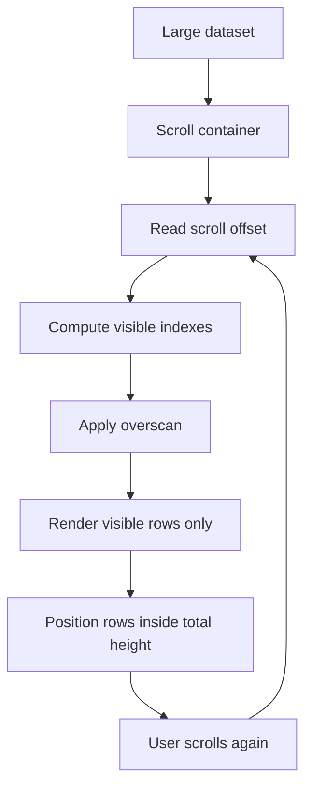
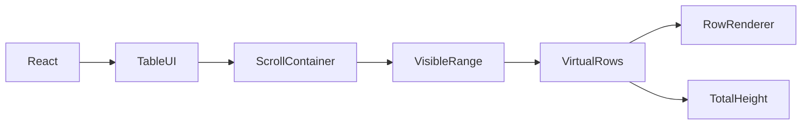

# Virtualised Table Exercise

## What is already done for you
- scaffold app created
- dependencies will be installed
- starter folders exist so you can focus on the exercise

## Read these in order
1. `INSTRUCTIONS.md`
2. `IMPLEMENTATION-GUIDE.md`
3. `GUIDED-EXAMPLES.md`
4. `PRACTICE-CHECKLIST.md`
5. `MILESTONES.md`

## Goal
Build a large data table that stays fast by rendering only the visible rows. Learn **virtualisation**, not just table rendering.

## What you should build
Create a table that can handle a large dataset, for example 1,000-50,000 rows, with:
- fixed-height rows first
- scroll container
- visible window rendering only
- optional sticky header
- optional sorting or row selection after the base version works

## Dependency map
- **React**: UI rendering
- **Virtualisation library or custom logic**: limits rendered rows
- **Scroll container**: tells you current viewport position
- **Row model**: full dataset in memory
- **Visible range calculation**: maps scroll position to rendered rows

## Core concepts to learn
1. **Why normal tables get slow**: too many DOM nodes
2. **Viewport**: only part of the list is visible
3. **Overscan**: render a few extra rows above and below
4. **Row positioning**: place visible rows correctly inside total height
5. **Fixed height first**: variable height is harder
6. **Performance tradeoff**: less DOM, more math

## Recommended build order
1. Render a plain table with a small dataset
2. Generate a much larger dataset
3. Measure or observe the slowdown
4. Add a scroll container with fixed height
5. Calculate visible start and end indexes
6. Render only those rows
7. Preserve total scroll height with spacer logic
8. Add overscan
9. Add table features only after scrolling is stable

## Repetition drill
Practice this mental model:
1. total rows exist in memory
2. viewport shows a slice
3. scroll position decides indexes
4. only visible rows render
5. top/bottom space preserves scroll illusion

## What to focus on while typing
- Start with fixed row height
- Keep row rendering simple
- Separate scroll math from row UI
- Verify that DOM node count stays low
- Add performance features before fancy table features

## Useful checks
- Does scrolling feel smooth?
- Does the DOM contain only visible rows?
- Does the scroll bar still represent the full dataset?
- Do rows jump or overlap?

## Mermaid flow

## Dependency graph

## Practice prompts
- 10,000-row user table
- log viewer
- transaction history
- sortable product inventory table

## Done when
- you can explain why virtualisation improves performance
- you can compute the visible range confidently
- you understand overscan
- the table scrolls smoothly with a large dataset