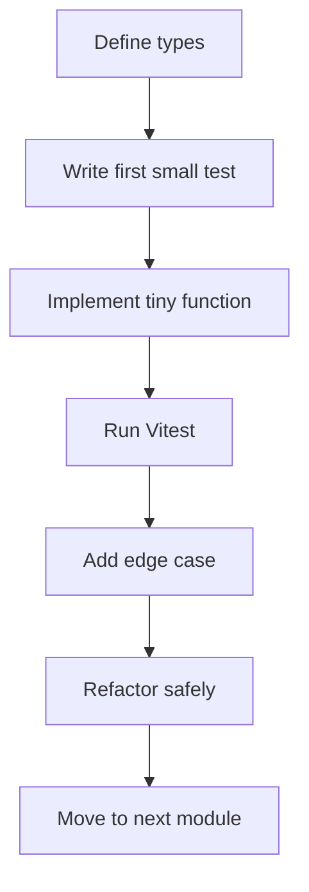
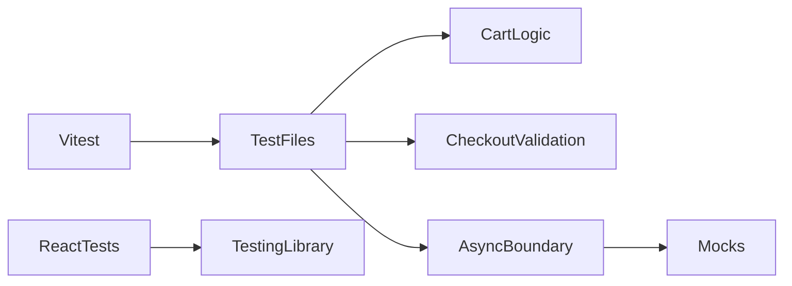

# Vitest Exercise

## Goal
Build and test small units of logic with **Vitest** so you learn fast feedback, confidence, and clean design.

## What is already done for you
This folder now includes the non-exercise setup so you can focus on the actual Vitest work:
- Vite app scaffold
- React + TypeScript setup
- Vitest configuration
- jsdom test environment
- Testing Library installation for optional UI tests

Read these in order:
- `IMPLEMENTATION-GUIDE.md` for the exact exercise plan
- `GUIDED-EXAMPLES.md` for code-shaped examples and test patterns
- `PRACTICE-CHECKLIST.md` for repetition

## What you should implement
Do **not** spend your time on boilerplate first.
Instead, implement actual testable code in stages:

1. **Pure cart utility functions**
2. **Checkout validation logic**
3. **Optional async function or hook**

Suggested domain: **shopping cart / checkout**

Suggested files to create:
- `src/exercise/cart/types.ts`
- `src/exercise/cart/calculateLineTotal.ts`
- `src/exercise/cart/calculateCartTotal.ts`
- `src/exercise/cart/applyDiscount.ts`
- `src/exercise/checkout/types.ts`
- `src/exercise/checkout/validateCheckout.ts`
- optional: `src/exercise/orders/fetchOrderSummary.ts`
- optional: `src/exercise/hooks/useOrderSummary.ts`

## Dependency map
- **Vitest**: runs tests and assertions
- **Source modules**: your business logic under test
- **Types**: make the problem explicit before implementation
- **Optional mocks/spies**: isolate async boundaries only when needed
- **Optional Testing Library**: useful if you reach hook or component tests

## Core concepts to learn
1. **Unit tests first on pure logic**
2. **Arrange / Act / Assert**
3. **Edge cases and boundary thinking**
4. **Structured outputs are easier to test than vague ones**
5. **Mocks are for boundaries, not for everything**
6. **Tests should protect behavior during refactoring**

## Recommended build order
1. Create cart and checkout types
2. Implement and test `calculateLineTotal`
3. Implement and test `calculateCartTotal`
4. Implement and test `applyDiscount`
5. Implement and test `validateCheckout`
6. Optionally add one async function or hook
7. Optionally add React Testing Library tests

## Repetition drill
Repeat this sequence from memory:
1. define the input shape
2. define one behavior
3. write one small test
4. implement the smallest logic to pass it
5. add one edge case
6. refactor without changing behavior

## What to focus on while typing
- keep functions small
- keep tests small
- test outputs, not internal implementation
- avoid mocks until async boundaries appear
- make invalid cases explicit

## Concrete behavior ideas
### `calculateLineTotal`
- multiplies price × quantity
- guards against invalid values if you choose

### `calculateCartTotal`
- sums multiple line totals
- handles empty carts

### `applyDiscount`
- supports fixed or percentage discount
- never returns negative totals

### `validateCheckout`
- returns structured validation errors
- can fail multiple fields at once

### Optional async module or hook
- exposes loading / success / error behavior
- is a good place to practice mocks

## Mermaid flow


## Dependency graph


## Commands
```bash
cd vitest-exercise
npm install
npm run dev
npm run test
npm run test:watch
```

## Done when
- you can build and run the scaffold without setup issues
- you can create the exercise modules yourself
- you can write pure function tests from memory
- you know when async tests need mocks
- you can refactor the implementation while tests stay green
