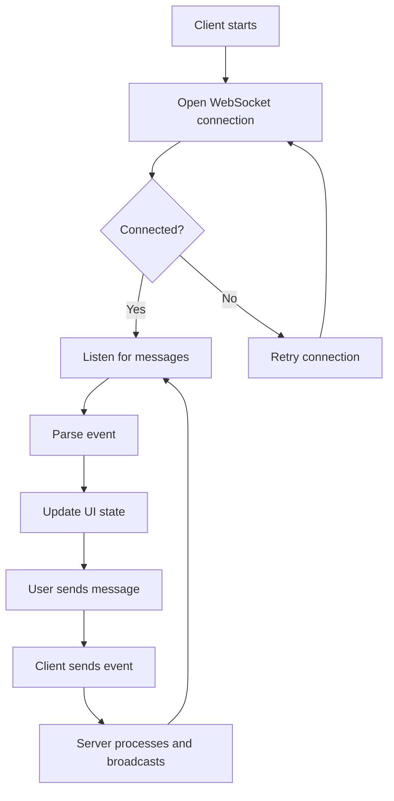
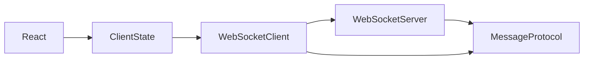

# WebSocket Exercise

## What is already done for you
- scaffold app created
- dependencies will be installed
- starter folders exist so you can focus on the exercise

## Read these in order
1. `INSTRUCTIONS.md`
2. `IMPLEMENTATION-GUIDE.md`
3. `GUIDED-EXAMPLES.md`
4. `PRACTICE-CHECKLIST.md`
5. `MILESTONES.md`

## Goal
Build a small real-time app with **WebSockets** so you understand persistent connections, event flow, and UI synchronization.

## What you should build
Create a tiny real-time feature, for example:
- chat room
- live notifications panel
- stock/score/ticker feed
- collaborative status board

Start with one connection and a few event types.

## Dependency map
- **React**: UI rendering
- **WebSocket client**: keeps an open connection in the browser
- **WebSocket server**: pushes and receives events
- **Message protocol**: defines event shapes
- **Connection state**: connecting, open, closed, retrying

## Core concepts to learn
1. **Persistent connection** vs request/response
2. **Bidirectional messaging**
3. **Connection lifecycle**: open, message, error, close
4. **Event protocol**: every message needs a predictable shape
5. **Reconnect strategy**: real apps lose connection
6. **State synchronization**: UI updates from incoming events
7. **Ordering and duplication**: messages may arrive awkwardly

## Recommended build order
1. Define a tiny message protocol
2. Build a server that can accept one connection
3. Build a client that connects and logs events
4. Show connection status in the UI
5. Send one message from client to server
6. Broadcast one message from server to client
7. Render incoming events in the UI
8. Add reconnect handling
9. Add simple guards against malformed messages

## Repetition drill
Repeat this mental loop:
1. connect
2. listen
3. parse message
4. update UI state
5. send event
6. handle close/reconnect

## Suggested message shape
Think in terms of:
- `type`
- `payload`
- optional `id`
- optional `timestamp`

Keep the protocol boring and predictable.

## What to focus on while typing
- Separate transport logic from UI
- Model connection state explicitly
- Parse and validate incoming messages
- Decide how to handle reconnects
- Avoid mixing optimistic local updates with server truth too early

## Mermaid flow

## Dependency graph

## Practice prompts
- build a room chat
- show live order status
- push notification toasts
- render a live activity feed

## Done when
- you can explain the socket lifecycle
- you can define a simple event protocol
- you can reconnect cleanly
- your UI reacts correctly to pushed events